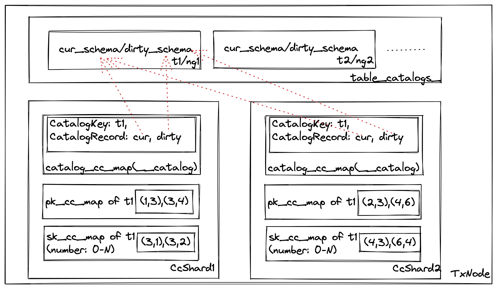
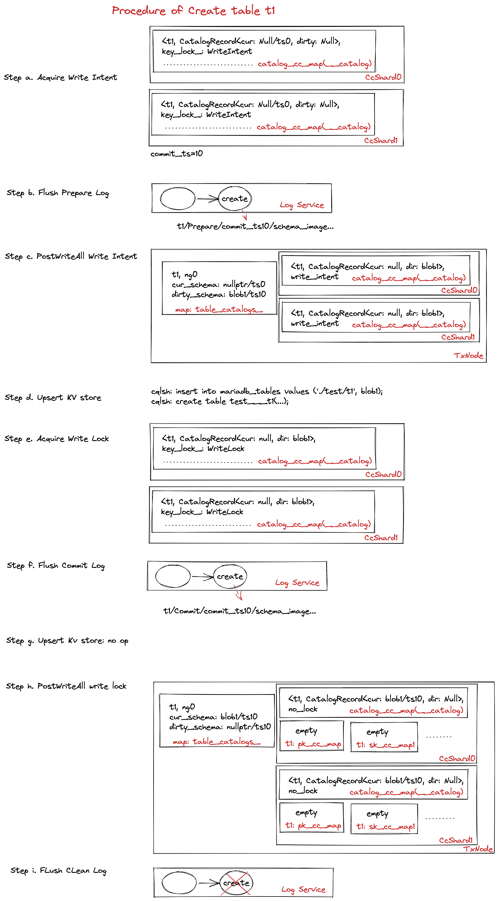

# Catalog Design.

## Where Catalog Stored?

In general, catalog are stored in kv store(e.g. Casssandra) permenantly. Catalog are cached in each tx_service for fast access.

### Catalog in Cassandra

Table catalogs are stored in Cassandra table: `mono.mariadb_tables` with following schema.

```
cqlsh:mono> desc mono.mariadb_tables;

CREATE TABLE mono.mariadb_tables (
    tablename text PRIMARY KEY,
    content blob
) WITH ...
```

`mono.mariadb_tables` stores table name and it's content (frm binary for Mysql).This is a temporary work to store frm binary currently. In future, we may store the `mono.mariadb_tables` with unified information like column name, column type, index keys, foreign keys, constraints etc.

Database catalog stores in `mono.mariadb_databases`. It consists of database name and its definition. Definition contains charset, collation etc. To be noted, database is different from normal tables and catalog like func, privilege. Database cannot leverage Mysql pluggable storage interface. Currently we modify the sql_db.cc in Mysql to migrate database catalog from local to a distributed kv store, which is neccessary in a multi-master database.

```
CREATE TABLE mono.mariadb_databases (
    dbname text PRIMARY KEY,
    definition blob
) WITH ...
```

View catalog stores in `mono.mariadb_views`

TODO(xiaoyang): Please update this section.


Other catalogs like use privilege, procedure, sequences etc. are stored as normal monograph tables. They are mostly stored in `mysql` database which inherits from Mysql (to be specific, standard Mysql stores these catalog in `mysql` database with Aria engine).

Currently, these catalogs are stored distributed across the cluster. Mysql will read some catalog tables during startup. As a result,  Mysql startup process depends on the tx_service cluster is ready. Here the ready means all the txnodes finishes the log recovery and can serve transactions. We added a checker in monograph engine initializer to support this behavior.

```
cqlsh:mono> desc tables;

mariadb_databases                      mysql___proxies_priv___grantor
mariadb_tables                         mysql___roles_mapping
mariadb_views                          mysql___sequences
mvcc_archives                          mysql___table_stats
mysql___column_stats                   mysql___tables_priv
mysql___columns_priv                   mysql___tables_priv___grantor
mysql___db                             mysql___time_zone
mysql___db___user                      mysql___time_zone_leap_second
mysql___event                          mysql___time_zone_name
mysql___func                           mysql___time_zone_transition
mysql___global_priv                    mysql___time_zone_transition_type
......
```


### Catalog in DynamoDB
TBD

### Catalog in Memory
Access KV store is slow, monographDB stores the catalog in memory as well. Catalogs like privilege are normal monograph tables, which are stored in ccmap directly. This section focus on how does monographDB store table catalog in tx_service layer.

<p align="center">

Figure 1 Catalog In Memory
</p>

Table catalog are physically stored in LocalCcShard for each txnode (named table_catalogs_). They are organized as nested map: TableName->NodeGroup->CatalogEntry.

```
//local_cc_shard.h
std::unordered_map<TableName, std::unordered_map<NodeGroupId, CatalogEntry>> table_catalogs_;
```

The CatalogEntry stores the actual current schema and dirty schema using shared_ptr. Shared_ptr means the schema pointers are owned by CatalogEntry and CatalogRecord together. When leader becomes follower, we will erase CatalogEntry, but the schema pointers should not be freed, since there is a chance the Mysql thread is accessing it concurrently. The TableSchema is created by MariaCatalogFactory `CreateTableSchema()`. It will take catalog_image as input and call `init_from_binary_frm_no_thd()` to parse the image into mysql::TABLE_SHARE. 

```
struct CatalogEntry
{
  std::shared_ptr<TableSchema> schema_{nullptr};
  std::shared_ptr<TableSchema> dirty_schema_{nullptr};
  uint64_t schema_version_{0};
  uint64_t dirty_schema_version_{0};
}
```

CatalogEntry is at node level, and we have CatalogRecord at ccshard level. In each ccshard, there is a special ccmap called catalog_cc_map. Its key is `__catalog` and the content of ccmap are kvpairs where key is table name and value is CatalogRecord. CatalogRecord is similar to CatalogEntry. The main difference is that CatalogRecord contains schema_image_ which may contain the serialized images of schema in kv store or the binary image of the dirty schema from upper engine, e.g. hamonograph::create().

```
struct CatalogRecord
{
  std::shared_ptr<TableSchema> schema_{nullptr};
  std::shared_ptr<TableSchema> dirty_schema_{nullptr};
  uint64_t schema_ts_{0};
  std::string schema_image_{""};
}
```


#### Fetch Table Catalog
Suppose a table is created by previous transaction and server restart. Then how does table catalog being fetched from KV store? There are two ways in monographdb:

1. Using monograph_discover_table() interface in ha_monograph. When this is the first open_table on the target table t1. Handler interface `monograph_discover_table()` will be called. It will issue a local ReadTxRequest to Tx_service to get the table catalog. Local ReadTxRequest will read a special ccmap `__catalog` using ReadCcRequest. Generally this ccmap is similar to normal TemplateCcMap, but has some additional logics which are impemented in catalog_cc_map.h. The logics include: For ReadType::Inside, if the catalog_ccmap doesn't contain the value, check whether the CatalogEntry is constructed at this node. If so create pk/sk ccmap and install the value into catalog_ccmap on the fly. For ReadType::Outside, create CatalogEntry and pk/sk ccmaps on the fly.

2. Fetch catalog from kv store on the fly. When executing a CcRequest on a ccmap, the ccmap may not be created yet. If LocalCcShard contains the catalog, then we are able to create the ccmap based on catalog. But if the catalog doesn't exist, then we need to generate FetchCatalogCc request to fetch catalog from kv store on the fly. The current CcRequest will be queued in FetchCatalogCc request. And once the catalog in kv store is returned and FetchCatalogCc finished, then the queued CcRequest will be executed again.

#### Create/Drop Table Catalog
Create/Drop Table statement in Mysql will create/drop the table catalog. We focus on both normal DDL and replay DDL as follows:

1. Normal create/drop table DDL.

Create/Drop table in monographDB is implemented as a multi-phase operations:

a. acquire all the write intents: This is used to prevent concurrent DDL on the same table.

b. flush prepare log: when prepare log is flushed, the DDL must be succeed no matter node crash or network errors. See Replay DDL section for details.

c. postprocess all the write intents: it doesn't release the write intent, but create the dirty version of the schema. To be more detail, PostWriteAllCc request with PostWriteType::PrepareCommit is used to handle this stage. For shard0, it will call `CreateDirtyCatalog` to generate the dirty schema on LocalCcShard. The catalogRecord on each ccshard will be uploaded as well with the new dirty schema. From now on, concurrent DML on this table can see both current and dirty schema. This takes no effect on create/drop table, but it is crucial for creating index. The new insert/delete tuples will modify index tables for current and dirty schema at the same time.

d. upsert kv store (could be long running time): create table/alter table/create index on the kv store.

e. acquire all the write locks: this blocks all the DML on the table, but lock holding time is short.

f. flush commit log: record the kv store operation is finished in the log. If failover happens, we can start from this point.

g. upsert kv store (some kv delete op should happens after write lock is held): drop table on the kv store.

h. postprocess all the write locks: commit the dirty schema and release the write locks. Then later DML on the table can see the new schema. To be more detail, PostWriteAllCc request with PostWriteType::PostCommit is used to handle this stage. For drop table request, corresponding pkccmap and skccmap of the table will be dropped on every ccshard. And `CommitDirtyCatalog` will be called for the last ccshard to make dirty schema as current schema on LocalCcShard. 

i. flush clean log to truncate ddl record in log service.

<p align="center">

Figure 2 Create Table Steps
</p>

2. Replay DDL.

Case a. No failure during DDL. There are three logs which are flushed to log service: PrepareLog, CommitLog and CleanLog. The last CleanLog will clean the log service for this DDL. You can treat DDL do checkpoint inside the transaction and hence the redo log can be truncated when transaction finished.

Case b. Failure before Prepare log is flushed. This case will abort the current DDL.

Case c. Failure after Prepare log is flushed and before Commit log is flushed. Then the failover node will call `CreateDirtyCatalog()` to finish step c and call `AcquireWriteLock()` to finish step e. If the node is the original txCoordinator, it will call `CreateSchemaRecoveryTx()` to restart DDL operation(UpsertTableOp) from step c. Note that the `CreateSchemaRecoveryTx()` may `CreateDirtyCatalog()`, upsert kv store and `AcquireWriteLock()` again which requires these steps to be idempotent.

case d. Failure after commit log is flushed and before clean log is flushed. The failover node will call 	`CreateCatalog()` to create CatalogEntry in localCcshard and create pkccmap and skccmap respectively. It will also try to add itself into catalog_cc_map to finish step h. If it's txCoordinator, it will call `CreateSchemaRecoveryTx()` to restart DDL operation(UpsertTableOp) from step g.


Q&A Why do we have CatalogEntry on LocalCcShard and CatalogRecord on each CcShard?

This is due to access KV store is slower. By using CatalogEntry at LocalCcShard level, we can have only one access of KV store for each table on each node.

### Catalog Invalidation
TBD
